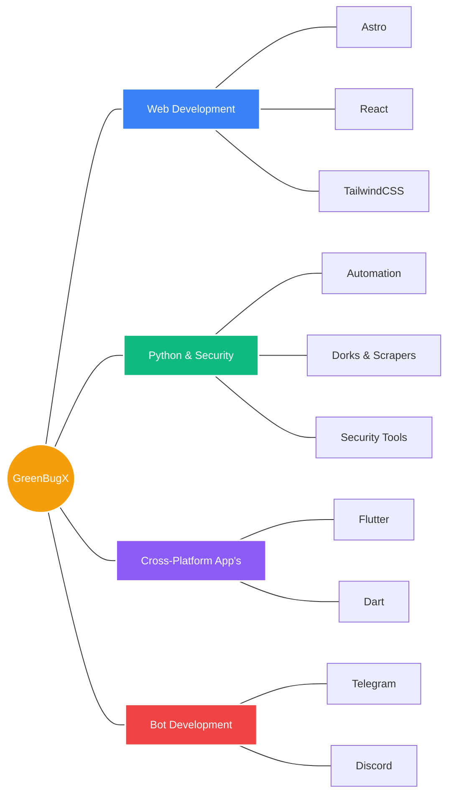

  
  
<i>Building apps & tools, exploring cybersecurity, and experimenting with new tech.</i>

  
  

---

### 🧠 My Ecosystem

---

### 👨‍💻 What I Do

I'm a developer who loves diving into the deep end of the tech pool. Here is a breakdown of my core focus areas:

  <table>
    <thead>
      <tr>
        <th align="left">Focus Area</th>
        <th align="left">Description & Technologies</th>
      </tr>
    </thead>
    <tbody>
      <tr>
        <td align="left">🌐 <strong>Web Development</strong></td>
        <td align="left">Crafting fast, modern, and responsive websites using <strong>Astro, React, and TailwindCSS</strong>.</td>
      </tr>
      <tr>
        <td align="left">🐍 <strong>Python & Security</strong></td>
        <td align="left">Writing automation scripts, exploring dorks/scrapers, and building security-testing tools.</td>
      </tr>
      <tr>
        <td align="left">🤖 <strong>Bot Development</strong></td>
        <td align="left">Crafting interactive and highly functional bots for <strong>Telegram</strong> and <strong>Discord</strong>.</td>
      </tr>
      <tr>
        <td align="left">📱 <strong>Cross-Platform</strong></td>
        <td align="left">Building versatile applications for Android, iOS, Windows, and Linux using <strong>Flutter (Dart)</strong>.</td>
      </tr>
    </tbody>
  </table>

---

### 🚀 Currently Building & Learning

  <table>
    <thead>
      <tr>
        <th align="left">Project / Focus</th>
        <th align="center">Status</th>
        <th align="left">Description</th>
      </tr>
    </thead>
    <tbody>
      <tr>
        <td align="left"><strong>EasyLang</strong></td>
        <td align="center">🏗️ <em>Building</em></td>
        <td align="left">An English-like programming language designed to be highly intuitive.</td>
      </tr>
      <tr>
        <td align="left"><strong>Hongeet</strong></td>
        <td align="center">🎵 <em>Building</em></td>
        <td align="left">A multi-streaming service-powered music player.</td>
      </tr>
      <tr>
        <td align="left"><strong>Backend & APIs</strong></td>
        <td align="center">🧠 <em>Learning</em></td>
        <td align="left">Deep diving into APIs and designing robust backend structures.</td>
      </tr>
      <tr>
        <td align="left"><strong>Frontend Magic</strong></td>
        <td align="center">✨ <em>Creating</em></td>
        <td align="left">Continuously experimenting to create responsive, lightweight UI/UX.</td>
      </tr>
    </tbody>
  </table>

### 🛠️ Tech Stack

  

---

### ⚡ Random Fact

> I still break my own code sometimes. *(But that's exactly how we learn, right?)*

---

### 🐍 GitHub Contributions

  <picture>
    <source media="(prefers-color-scheme: dark)" srcset="https://raw.githubusercontent.com/dku-da-cpu/dku-da-cpu/output/github-snake-dark.svg">
    <source media="(prefers-color-scheme: light)" srcset="https://raw.githubusercontent.com/dku-da-cpu/dku-da-cpu/output/github-snake.svg">
    
  </picture>

